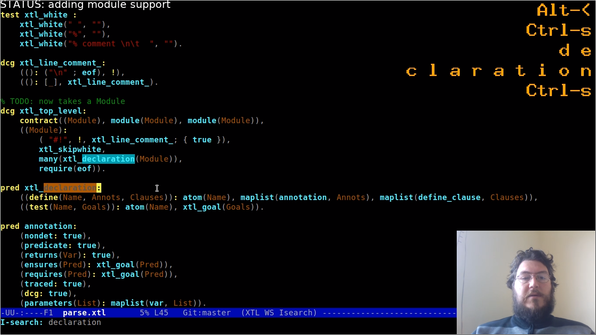

# Helper scripts for live coding on Twitch

- Show all keys being pressed
- Webcam inset with optional filtering
- Can capture both microphone and audio out
- Dynamic text overlay
- Video settings tuned for code



Watch me on https://www.twitch.tv/choongmoo

# Requirements

* Linux
* FFmpeg
* osd\_cat
* SWI-Prolog
* Xnee
* This repository

On Ubuntu:

```
apt-get install ffmpeg xosd-bin swi-prolog xnee git
git clone https://github.com/AtnNn/twitch-stream
cd twitch-stream
```

# Usage

Place your Twitch stream key in the `key.secret` file.

* Adjust the "Manual settings" in [`stream.sh`](stream.sh).
* Run `./stream.sh` to start streaming.
* Run `./showkeys.sh` to display the keys being pressed.
